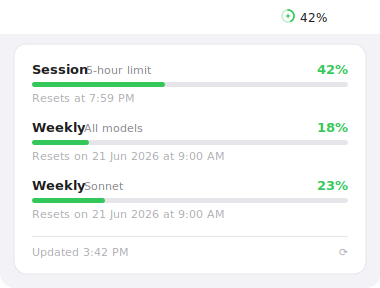

<div align="center">

# ⚡ SparkBar

**Your Claude usage, right in the macOS menu bar.**

Session & weekly limits at a glance — a color-coded icon, threshold alerts, and a
native SwiftUI popover. Reads your existing **Claude Code** login; no cookies, no
setup.

[](https://github.com/Hokore-Dev/sparkbar/actions/workflows/build.yml)
[](https://github.com/Hokore-Dev/sparkbar/releases)
[](LICENSE)
[](https://www.apple.com/macos/)
[](https://github.com/sponsors/Hokore-Dev)
[](https://github.com/Hokore-Dev/sparkbar/stargazers)



</div>

## Why

If you use Claude Code, you already hit the 5-hour and weekly limits — usually at
the worst time. SparkBar keeps that number one glance away, turns the icon
orange then red as you climb, and nudges you before you run out. It piggybacks on
the credentials Claude Code already manages, so there is nothing to paste or
configure.

## Features

- 📊 **Session & weekly usage** — progress bars with reset times (plus weekly Sonnet when reported)
- 🎨 **Color-coded menu bar icon** — spark glyph turns green → orange → red as session usage climbs
- 🔔 **Threshold alerts** — notifications at 25%, 50%, 75%, and 90% of the session limit
- ⌨️ **⌘U shortcut** — open the popover from anywhere
- 🔄 **Auto-refresh** — every 5 minutes and on menu open
- 🚀 **Open at login** — optional (macOS 13+)
- 🔒 **Local & private** — no analytics; your token only ever talks to Anthropic's API
- 🎯 **Menu bar only** — no Dock icon, stays out of your way

## Install

### Homebrew

```bash
brew install --cask hokore-dev/tap/sparkbar
```

> Published via a [Homebrew tap](homebrew/README.md). `brew upgrade --cask sparkbar` keeps it current.

### Download

Grab the latest `SparkBar.zip` from the [**Releases**](https://github.com/Hokore-Dev/sparkbar/releases)
page, unzip it, and move **SparkBar.app** to `/Applications`. Release builds are
signed with a Developer ID and notarized by Apple, so a normal double-click
opens them. On first launch SparkBar may ask permission to read the Claude Code
login keychain item — click **Allow**.

### Build from source

```bash
git clone https://github.com/Hokore-Dev/sparkbar.git
cd sparkbar/app
./build.sh
```

This compiles a universal (arm64 + x86_64) binary, ad-hoc signs it, and launches
it. The app bundle lands at `app/build/SparkBar.app`.

**Requirements:** macOS 12.0+, Xcode Command Line Tools, and
[Claude Code](https://claude.com/claude-code) logged in (`claude login`).

## How it works

```
Claude Code login keychain ──► OAuth access token (auto-refreshed)
            │
            ▼
api.anthropic.com/api/oauth/usage ──► session / weekly / weekly-Sonnet windows
            │
            ▼
        menu bar icon + popover gauges + threshold notifications
```

The app reads the OAuth token that `claude login` stores in your login keychain
(service `Claude Code-credentials`) — the same credential Claude Code uses — and
refreshes it when it expires. Nothing leaves your Mac except the calls to
Anthropic's API. See [SECURITY.md](SECURITY.md) for details.

## Sponsor

SparkBar is free and open source, built and maintained in spare time. If it
saves you from one "limit reached" surprise, please consider sponsoring its
development — it genuinely helps.

<a href="https://github.com/sponsors/Hokore-Dev">
  
</a>

## Star History

<a href="https://star-history.com/#Hokore-Dev/sparkbar&Date">
  
</a>

## Contributing

Issues and PRs are welcome — see [CONTRIBUTING.md](CONTRIBUTING.md) and the
[Code of Conduct](CODE_OF_CONDUCT.md). For the version history, see
[CHANGELOG.md](CHANGELOG.md).

## License

MIT © 2026 Hokore — see [LICENSE](LICENSE).

## Disclaimer

This app calls Anthropic's API using your own Claude Code credentials. It is not
affiliated with or endorsed by Anthropic, and the endpoints it relies on may
change without notice. Use at your own risk.
